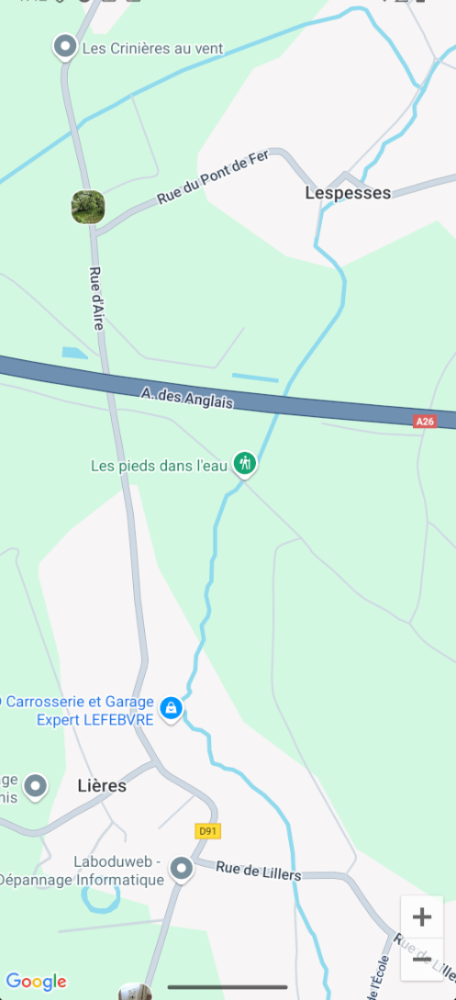

# SDK - Carte interactive React Native

## Présentation

Ce projet est une application React Native permettant d'afficher une carte interactive (Google Maps) sur laquelle l'utilisateur peut ajouter des marqueurs personnalisés avec une image de sa galerie. Les marqueurs sont déplaçables et chaque image est affichée sur la carte.

## Aperçu



   ```

## Utilisation

- Appuyez sur la carte pour ajouter un marqueur.
- Sélectionnez une image dans votre galerie pour l'associer au marqueur.
- Faites glisser un marqueur pour le déplacer.

## Fonctionnalités principales

- Affichage d'une carte Google Maps centrée sur une région par défaut.
- Ajout de marqueurs personnalisés avec image depuis la galerie.
- Déplacement des marqueurs par glisser-déposer.
- Permissions gérées pour accéder à la galerie.

## Structure du projet

- `App.js` : Point d'entrée de l'application.
- `components/map/Map.js` : Composant principal de la carte interactive.
- `components/map/MarkerItem.js` : Affichage personnalisé des marqueurs avec image.
- `assets/` : Images et icônes utilisées dans l'application.

